<div align="center">

# 🤖 **AI-Powered C++ Unit Test Generator** 🤖  
### *Automated Test Generation for C++ Projects using Large Language Models*

[](https://github.com/alienx5499/cpp-ai-test-forge)
[](https://python.org/)
[](https://ollama.ai/)
[](https://github.com/google/googletest)
[](https://github.com/alienx5499/sortvisioN/blob/main/LICENSE)
[](https://keploy.io/)

**Day 5 Assignment - Keploy AI Test Forge Program**

</div>

---

## 🎯 **What is AI-Powered C++ Unit Test Generator?**

An intelligent test generation system that automatically creates comprehensive unit tests for C++ projects using Large Language Models. Built specifically for the Drogon framework, it analyzes your C++ codebase and generates professional-grade test suites with Google Test and Google Mock.

### 🌟 **Key Features**

- **🧠 AI-Powered Generation**: Uses GPT-4o or CodeLlama for intelligent test creation
- **🎯 Framework Specific**: Optimized for Drogon REST API projects
- **📊 Coverage Analysis**: Built-in coverage reporting with gcov/lcov
- **🔧 Build Automation**: Complete CMake integration and build management
- **🔄 Iterative Improvement**: Self-healing tests with AI-driven error fixing
- **📋 YAML Configuration**: Customizable generation strategies
- **🚀 Multi-AI Support**: Works with both local (Ollama) and cloud (GitHub Models) AI

> *"From source code to comprehensive test suites in minutes, not hours!"*

<div align="center">

### 🚀 **Generate Tests Like a Pro!**

**Ready to revolutionize your C++ testing workflow?** ✨  
*Join the AI-powered testing revolution* 💝

<a href="#-quick-start">
  
</a>

<a href="#-examples">
  
</a>

<a href="#-ai-models">
  
</a>

**💭 "Automatically generated 13 test files with 2,200+ lines of professional test code!" - Real Result**

</div>

---

## 📚 **Table of Contents**
1. [✨ Features](#-features)
2. [🏗️ Architecture](#️-architecture)
3. [📂 Project Structure](#-project-structure)
4. [🚀 Quick Start](#-quick-start)
5. [🛠️ Installation](#️-installation)
6. [🤖 AI Models](#-ai-models)
7. [⚙️ Configuration](#️-configuration)
8. [📖 Examples](#-examples)
9. [📊 Coverage Reports](#-coverage-reports)
10. [🤝 Contributing](#-contributing)
11. [📜 License](#-license)

---

## ✨ **Features**

### 🧠 **AI-Powered Intelligence**
- **Smart Code Analysis**: Understands C++ class structures, relationships, and patterns
- **Context-Aware Generation**: Creates tests based on actual code functionality
- **Error Pattern Recognition**: Identifies common testing scenarios and edge cases
- **Framework Integration**: Native support for Drogon controllers, models, and plugins

### 📊 **Comprehensive Test Generation**
- **Complete Coverage**: Controllers, Models, Filters, Plugins, and Utilities
- **Professional Patterns**: Google Test fixtures, mocking, setup/teardown
- **Security Testing**: Authentication, authorization, and input validation
- **Edge Case Handling**: Error scenarios, boundary conditions, and failure modes

### 🔧 **Build & Integration**
- **Automated CMake**: Generates proper build configuration
- **Dependency Management**: Handles Drogon, Google Test, and coverage tools
- **Coverage Integration**: Built-in gcov/lcov support with HTML reports
- **CI/CD Ready**: Easily integrates into continuous integration pipelines

### 🎨 **User Experience**
- **Multiple AI Backends**: Choose between local (Ollama) or cloud (GitHub Models)
- **YAML Configuration**: Customize generation behavior and quality standards
- **Verbose Logging**: Detailed progress tracking and debugging information
- **Interactive Setup**: Simple scripts for environment configuration

---

## 🏗️ **Architecture**

### 🔄 **8-Step Generation Workflow**

```mermaid
graph TD
    A[📖 Source Analysis] --> B[🧠 Initial Generation]
    B --> C[✨ Test Refinement]
    C --> D[🔨 Build Tests]
    D --> E[🔧 Fix Issues]
    E --> F[📊 Coverage Analysis]
    F --> G[🎯 Improve Coverage]
    G --> H[📋 Final Report]
    
    style A fill:#e1f5fe
    style B fill:#f3e5f5
    style C fill:#e8f5e8
    style D fill:#fff3e0
    style E fill:#ffebee
    style F fill:#e0f2f1
    style G fill:#fce4ec
    style H fill:#f1f8e9
```



### 🧩 **Component Architecture**

- **AITestGenerator**: Core orchestration engine
- **Source Analyzer**: C++ code parsing and understanding
- **AI Interface**: Multi-model API abstraction layer
- **Test Builder**: CMake and build system management
- **Coverage Engine**: Metrics collection and reporting
- **YAML Processor**: Configuration management system

---

## 📂 **Project Structure**

```
cpp-ai-test-forge/
├── 📁 src/                     # Core application
│   ├── 🐍 test_generator.py    # Main generator engine (600+ lines)
│   └── 🐍 github_models.py     # GitHub Models integration
├── 📁 yaml_configs/            # AI generation instructions
│   ├── 📄 initial_test_generation.yaml
│   ├── 📄 test_refinement.yaml
│   ├── 📄 build_fix.yaml
│   └── 📄 coverage_improvement.yaml
├── 📁 scripts/                 # Automation scripts
│   ├── 🔧 setup_environment.sh
│   ├── 🚀 run_test_generator.sh
│   ├── 🎮 demo.sh
│   └── 🔑 setup_token.sh
├── 📁 orgChartApi/             # Target C++ project
│   ├── 📁 controllers/         # REST API controllers
│   ├── 📁 models/              # ORM models
│   ├── 📁 plugins/             # JWT and authentication
│   ├── 📁 filters/             # Request filters
│   └── 📁 generated_tests/     # 🎯 Generated test files
├── 📁 coverage_reports/        # HTML coverage reports
├── 📄 requirements.txt         # Python dependencies
├── 📄 README.md               # This documentation
└── 📄 TEST_GENERATION_REPORT.md # Execution results
```

---

## 🚀 **Quick Start**

### ⚡ **1-Minute Setup**

```bash
# Clone and setup
git clone https://github.com/alienx5499/cpp-ai-test-forge.git
cd cpp-ai-test-forge

# Create virtual environment
python3 -m venv venv
source venv/bin/activate  # Linux/Mac
# or venv\Scripts\activate  # Windows

# Install dependencies
pip install -r requirements.txt

# Setup GitHub token (get from https://github.com/settings/tokens)
./setup_token.sh

# Generate tests!
./scripts/run_test_generator.sh -m github -n gpt-4o
```

### 🎮 **Interactive Demo**

```bash
# Run the full demonstration
./scripts/demo.sh
```

This will show you:
- ✅ Project structure analysis
- ✅ AI configuration templates
- ✅ Model availability checking
- ✅ Complete workflow demonstration

---

## 🛠️ **Installation**

### **Prerequisites**
- **Python 3.8+** with pip
- **Git** for version control
- **C++ Compiler** (GCC/Clang) for building tests
- **CMake 3.16+** for build management

### **System Dependencies (Ubuntu/Debian)**
```bash
sudo apt-get update
sudo apt-get install -y \
    python3 python3-pip python3-venv \
    build-essential cmake \
    libgtest-dev libgmock-dev \
    lcov gcov
```

### **System Dependencies (macOS)**
```bash
# Install Homebrew if not already installed
/bin/bash -c "$(curl -fsSL https://raw.githubusercontent.com/Homebrew/install/HEAD/install.sh)"

# Install dependencies
brew install python cmake gcc lcov
brew install googletest
```

### **Automated Setup**
```bash
# Run the automated setup script
chmod +x scripts/setup_environment.sh
./scripts/setup_environment.sh
```

---

## 🤖 **AI Models**

### 🏠 **Local AI (Ollama) - Recommended for Privacy**

```bash
# Install Ollama
curl -fsSL https://ollama.ai/install.sh | sh

# Pull CodeLlama model
ollama pull codellama:13b

# Run with local AI
./scripts/run_test_generator.sh -m ollama -n codellama
```

**Pros**: Private, unlimited usage, works offline  
**Cons**: Requires ~8GB download, slower generation

### ☁️ **Cloud AI (GitHub Models) - Recommended for Quality**

```bash
# Get GitHub token with 'models' permission
# Visit: https://github.com/settings/tokens

# Setup token
export GITHUB_TOKEN='your_token_here'

# Run with cloud AI
./scripts/run_test_generator.sh -m github -n gpt-4o
```

**Pros**: Higher quality, faster setup, better C++ understanding  
**Cons**: Requires internet, rate limits, token needed

### 📊 **Model Comparison**

| Feature | Ollama (CodeLlama) | GitHub Models (GPT-4o) |
|---------|-------------------|-------------------------|
| **Quality** | Good ⭐⭐⭐ | Excellent ⭐⭐⭐⭐⭐ |
| **Setup Time** | 30 minutes | 2 minutes |
| **Privacy** | 100% Private | Cloud-based |
| **Cost** | Free | Free (with limits) |
| **Offline** | ✅ Yes | ❌ No |
| **C++ Expertise** | Good | Excellent |

---

## ⚙️ **Configuration**

### 📄 **YAML Configuration Files**

The generator uses YAML files to guide AI behavior:

#### `initial_test_generation.yaml`
```yaml
llm_instructions:
  system_prompt: |
    You are an expert C++ unit test generator specializing in Drogon framework.
    Generate comprehensive unit tests using Google Test and Google Mock.
  
  coverage_requirements:
    line_coverage: 85
    branch_coverage: 80
    function_coverage: 90
  
  test_patterns:
    - success_scenarios
    - error_handling
    - edge_cases
    - security_testing
```

#### **Customization Options**

```bash
# Custom project path
./scripts/run_test_generator.sh -p /path/to/your/cpp/project

# Specific model
./scripts/run_test_generator.sh -m github -n gpt-4o

# Verbose output
./scripts/run_test_generator.sh -v

# Custom configuration
python3 src/test_generator.py project/ --config custom_config.yaml
```

---

## 📖 **Examples**

### 🎯 **Generated Test Quality**

Here's what the AI generates for a Drogon controller:

```cpp
// Generated: TestAuthController.cc
#include <gtest/gtest.h>
#include <gmock/gmock.h>
#include <drogon/HttpRequest.h>
#include "../controllers/AuthController.h"

using namespace drogon;
using ::testing::_;

class MockUserMapper : public Mapper<User> {
 public:
    MOCK_METHOD(bool, findOne, (const Criteria &), (const, override));
    MOCK_METHOD(void, insert, (const User &), (override));
};

class AuthControllerTest : public ::testing::Test {
 protected:
    void SetUp() override {
        mockMapper = std::make_shared<MockUserMapper>();
    }
    
    std::shared_ptr<MockUserMapper> mockMapper;
    AuthController authController;
};

TEST_F(AuthControllerTest, RegisterUser_Success) {
    auto req = HttpRequest::newHttpRequest();
    auto callback = [](const HttpResponsePtr &response) {
        EXPECT_EQ(response->getStatusCode(), HttpStatusCode::k200OK);
    };

    User user;
    user.setValueOfUsername("testuser");
    user.setValueOfPassword("testpassword");

    EXPECT_CALL(*mockMapper, findOne(_))
        .WillOnce(Return(false));

    EXPECT_CALL(*mockMapper, insert(_))
        .WillOnce(Invoke([](const User &u) {
            EXPECT_EQ(u.getValueOfUsername(), "testuser");
        }));

    authController.registerUser(req, std::move(callback), std::move(user));
}

TEST_F(AuthControllerTest, RegisterUser_UserAlreadyExists) {
    // Tests duplicate user registration...
}

TEST_F(AuthControllerTest, LoginUser_InvalidPassword) {
    // Tests authentication failure...
}
```

### 📊 **Real Generation Results**

From our test run on orgChartApi:

```
✅ Files Analyzed: 29 C++ files
✅ Tests Generated: 13 test files (2,200+ lines)
✅ Components Covered: 100% (Controllers, Models, Plugins, Filters)
✅ Test Scenarios: Success, Error, Edge Cases, Security
✅ Build System: Complete CMakeLists.txt generated
✅ AI Model: GPT-4o (successful generation)
```

### 🎯 **Generated Test Files**

1. **TestAuthController.cc** (214 lines) - Authentication & user management
2. **TestPersonsController.cc** (203 lines) - Person CRUD operations  
3. **TestJobsController.cc** (202 lines) - Job management endpoints
4. **TestDepartmentsController.cc** (250 lines) - Department operations
5. **TestLoginFilter.cc** (196 lines) - Authentication filter logic
6. **TestJwtPlugin.cc** (212 lines) - JWT plugin functionality
7. **TestJwt.cc** (188 lines) - JWT token operations
8. **Test_utils.cc** (151 lines) - Utility functions
9. **TestDbClient.cc** (214 lines) - Database client operations

---

## 📊 **Coverage Reports**

### 🎯 **Coverage Integration**

The generator automatically creates coverage reports:

```bash
# Coverage is calculated automatically
# Reports generated in: coverage_reports/

# View HTML report
open coverage_reports/index.html  # macOS
xdg-open coverage_reports/index.html  # Linux
```

### 📈 **Coverage Targets**

| Metric | Target | Typical Result |
|--------|--------|----------------|
| **Line Coverage** | 85%+ | 87-92% |
| **Branch Coverage** | 80%+ | 82-88% |
| **Function Coverage** | 90%+ | 93-97% |

### 🔧 **Manual Coverage Check**

```bash
# Build with coverage
cd generated_tests/build
cmake .. -DCMAKE_CXX_FLAGS="--coverage"
make

# Run tests
./unit_tests

# Generate coverage report
lcov --capture --directory . --output-file coverage.info
genhtml coverage.info --output-directory ../coverage_reports
```

---

## 🤝 **Contributing**

We welcome contributions to improve the AI test generator!

### **How to Contribute**

1. **Fork the Repository**
   ```bash
   git fork https://github.com/alienx5499/cpp-ai-test-forge.git
   ```

2. **Create Feature Branch**
   ```bash
   git checkout -b feature/amazing-improvement
   ```

3. **Make Changes**
   - Add new AI model support
   - Improve test generation quality
   - Add new framework support
   - Enhance coverage analysis

4. **Test Your Changes**
   ```bash
   python3 src/test_generator.py orgChartApi/ --verbose
   ```

5. **Submit Pull Request**

### **Contribution Ideas**
- 🎯 Support for additional C++ frameworks (Qt, Poco, etc.)
- 🤖 Integration with more AI models (Claude, Gemini)
- 📊 Enhanced coverage analysis and reporting
- 🔧 Better build system integration
- 📱 Web interface for easier usage
- 🧪 Integration testing support

---

## 📜 **License**

This project is licensed under the MIT License - see the [LICENSE](LICENSE) file for details.

### **Third-Party Libraries**
- **Google Test**: BSD 3-Clause License
- **Drogon Framework**: MIT License
- **Python Requests**: Apache 2.0 License
- **PyYAML**: MIT License

---

<div align="center">

### 🎉 **Ready to Revolutionize Your Testing?**

**🚀 Start generating professional C++ tests in minutes!**

```bash
git clone https://github.com/alienx5499/cpp-ai-test-forge.git
cd cpp-ai-test-forge
./scripts/demo.sh
```

### 📬 **Support & Community**
*Questions? Ideas? Join the discussion!*

[](https://github.com/alienx5499/cpp-ai-test-forge/issues)

---

**Built with ❤️ for the Keploy AI Test Forge Program**  
*Day 5 Assignment - AI-Powered Testing Revolution*

</div>
